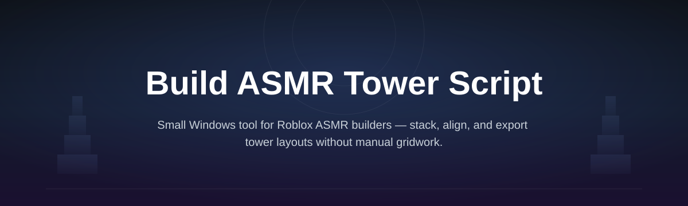
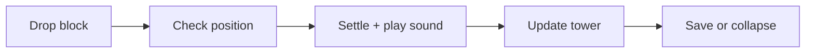

# asmr-tower-builder

*A quiet, layer-by-layer tower builder for creators who want satisfying block-stacking footage without editing sound in post.*

## What this is

The most immediately obvious thing when you open asmr-tower-builder is the stacking behavior itself: each block you drop settles with its own micro-delay and a matching audio layer, so towers build up with the kind of gentle click-clack rhythm you'd normally spend hours syncing in a video editor. That's the core of what this script does — it lets you build an ASMR tower on screen, block by block, while the sound and motion stay in sync automatically.

asmr-tower-builder is a standalone Windows tool for building layered, physics-reactive towers meant for recording — think satisfying-video channels, background loops for streams, or simple fidget-style desktop builds. It isn't a game engine or a plugin; it's a single script you run, a tower you build with a few keys and a mouse, and a clean canvas you can capture directly with any screen recorder.

  

This button opens the project's landing page, where the current build is available to download.

## Who it is for

- **ASMR and satisfying-content creators** who need clean, repeatable stacking footage
- **Streamers** who want a calm on-screen background activity between segments
- **Hobbyists** who enjoy fidget-style builders but don't want a full game installed
- **Video editors** who need short stacking clips without recording real physical blocks
- **Teachers or presenters** using a gentle visual as a timer or transition screen

## What you can do

- **Drop layered blocks** one at a time with individually tuned settle sounds
- **Adjust tower height limits** so builds stop cleanly instead of toppling by accident
- **Switch block materials** (wood, glass, stone-style) each with a distinct tone
- **Record-friendly canvas** with no UI clutter once you enter build mode
- **Save a tower layout** and reopen it later to continue or re-record it
- **Control build speed** so stacking feels slow and deliberate or quick and busy
- **Trigger a controlled collapse** for a satisfying reset instead of an abrupt restart
- **Run fully offline** with no account, login, or internet connection required

## Keyboard shortcuts

| Key | Action |
|---|---|
| `Space` | Drop the next block |
| `↑ / ↓` | Raise or lower drop height |
| `←→` | Nudge block position left/right before it drops |
| `M` | Cycle block material |
| `R` | Reset current tower |
| `C` | Trigger a controlled collapse |
| `S` | Save current layout |
| `L` | Load a saved layout |
| `Esc` | Exit build mode |

## Getting started

1. Open the landing page using the download button above.
2. Download the current Windows build.
3. Extract the folder anywhere on your machine.
4. Run the executable — no installer or setup wizard.
5. Press `Space` to drop your first block and start building.

## Requirements

- Windows 10 or 11 (64-bit)
- No install, no external toolchain, no dependencies to configure
- Runs as a standalone executable — nothing else to set up
- A screen recorder of your choice if you're capturing footage (not included)

## How it works

1. You place or drop a block using the keyboard.
2. The script checks the block's position against the current tower shape.
3. If it settles, a matching sound layer plays and the tower height updates.
4. If it overbalances, physics takes over and the stack reacts accordingly.
5. You can save the resulting layout or trigger a collapse to reset.

## FAQ

**Does this record video or audio automatically?**
No. It builds the tower and plays synced sounds; capturing footage is done with your own screen/audio recorder.

**Can I use my own sound set for the blocks?**
Not in the current build — each material has a fixed, pre-tuned sound layer designed to stay in sync with the drop timing.

**Will towers ever collapse on their own?**
Yes, if a block is placed off-balance the stack will react physically rather than snapping into place.

**Is there a limit to how tall a tower can get?**
Height is configurable; very tall towers become harder to keep stable, which is part of the intended challenge.

**Does it work on a laptop with a touchpad instead of a mouse?**
Yes — building is keyboard-driven, so a mouse is only needed for optional camera adjustments.

## Troubleshooting

- **The window opens but stays blank:** update your graphics driver; the renderer needs a reasonably current GPU driver on Windows.
- **Sounds are delayed from the block drop:** lower the build speed setting — very fast drop rates can outpace audio playback on slower drives.
- **Saved layouts won't reload:** make sure the save file wasn't moved out of its original folder; the loader expects a relative path.
- **Tower collapses immediately on load:** the saved layout may have been built with a different height limit than your current settings.

## License

Released under the [MIT License](LICENSE). The project is provided as-is, with no warranty; use it for your own recordings and builds at your own discretion.

  

